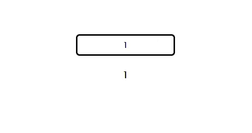

# Bin2Dec
Convert binary numbers to decimal using Python, AJAX and Flask.



# How to use
1. In the directory of the repository, start the Flask server by running the following command:
    ```python 
    python server.py
    ```
    Note: Make sure you have Python installed and the necessary dependencies installed (flask and any other required libraries).

2. Open your web browser and go to http://localhost:5000/bin2dec.


By following these steps, you will be able to access and use the Bin2Dec application through your web browser.